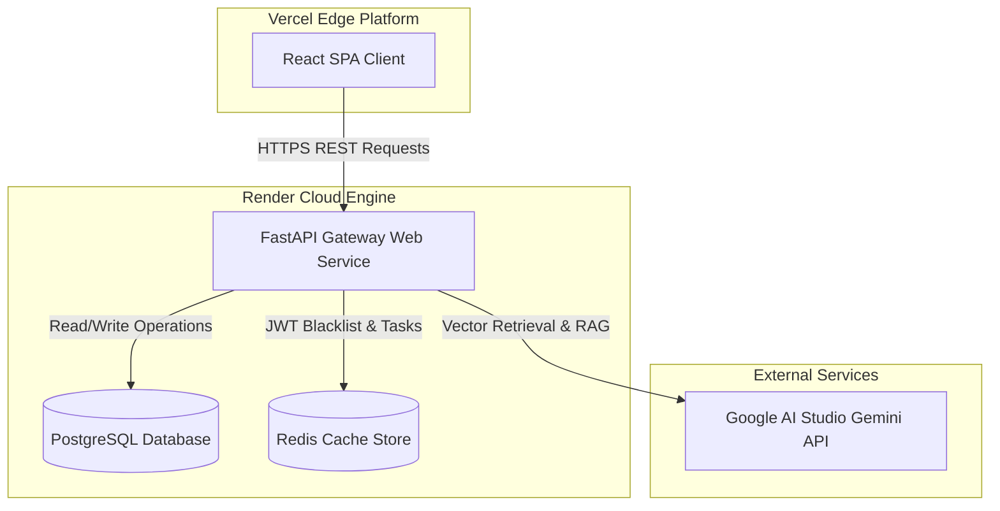

# Production Deployment Guide - HealthGPT

This document details the production architecture, cloud provisioning steps, deployment checklists, and troubleshooting runbooks for HealthGPT.

## Deployment Architecture Diagram

## Step-by-Step Deployment Instructions

### 1. Database Provisioning (PostgreSQL)
1. Go to the [Render Dashboard](https://dashboard.render.com/) and click **New > Database**.
2. Name the database `zentra-db`, select a region, and choose the database name as `healthgpt`.
3. Copy the **Internal Database URL** for the backend service, and **External Connection String** for migrations.

### 2. Redis Caching Setup
1. Click **New > Redis** in the Render console.
2. Set the name to `zentra-redis` and select the same region as the database.
3. Save the connection details.

### 3. FastAPI Backend Deployment (Render)
1. Click **New > Web Service** and link your Github repository.
2. Configure settings:
   - **Environment**: `Python`
   - **Build Command**: `pip install -r requirements.txt && python app/rag/embed_data.py`
   - **Start Command**: `uvicorn app.main:app --host 0.0.0.0 --port $PORT`
3. Add the environment variables from the checklist below.

### 4. React UI Deployment (Vercel)
1. In the Vercel dashboard, select **New Project** and import the `zentra-ui` subdirectory.
2. Define the **Build Settings**:
   - **Framework Preset**: `Vite`
   - **Root Directory**: `zentra-ui`
   - **Install Command**: `npm install`
   - **Build Command**: `npm run build`
3. Add Environment Variable:
   - `VITE_API_URL` pointing to the Render API root.

---

## Deployment Checklist

- [ ] Core Settings: `ENVIRONMENT` set to `production`
- [ ] Database Connection: `DATABASE_URL` linked to live PostgreSQL instances
- [ ] Security keys: Strong `SECRET_KEY` generated
- [ ] API access: Valid `GEMINI_API_KEY` defined
- [ ] CORS: `FRONTEND_URL` points to Vercel domain
- [ ] Database verification: Tables created via SQLAlchemy lifespan execution on start.

---

## Troubleshooting Guide

### Issue 1: CORS Blockage in Frontend
- **Symptom**: React frontend displays network exceptions when requesting endpoints.
- **Fix**: Verify that `FRONTEND_URL` matches Vercel's exact staging/production domain without trailing slashes.

### Issue 2: ChromaDB Initialization Fails on Render
- **Symptom**: Container exits due to permission/directory write locks.
- **Fix**: Set environment variable `CHROMA_PATH` to a writable subdirectory (e.g. `chroma_db`). Verify embedding scripts don't conflict.

### Issue 3: Gunicorn / Uvicorn Port Mismatch
- **Symptom**: Web service builds successfully but fails to respond to ping health checks.
- **Fix**: Ensure startup command listens on `0.0.0.0` and references the environment-provided `$PORT`.
