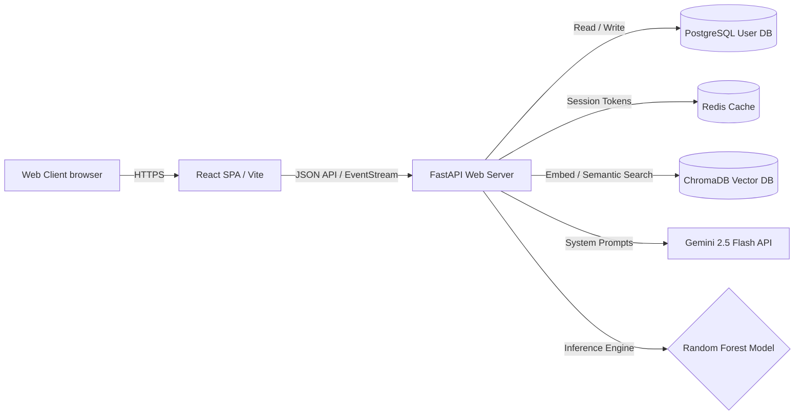

# System Architecture Documentation - HealthGPT

## 1. High-Level System Architecture

HealthGPT (Zentra) follows a decoupled multi-tier web application architecture designed to offer high-concurrency client actions, fast RAG queries, and ML prediction runs.

---

## 2. Component Blueprint

### 2.1 Frontend Component Layer (React SPA)
- **Vite React & TypeScript**: Highly responsive interface compiling components with minimum build footprints.
- **Zustand State Store**: Implements lightweight stores for authentication tokens, user profile payloads, and session histories.
- **Framer Motion**: Integrates modern glassmorphism micro-animations.

### 2.2 Backend Gateway Layer (FastAPI)
- **Router Pattern**: Decoupled routes handling endpoints via dependency injection:
  - `auth_router.py`: Handles signup, login, and verification tokens.
  - `profile_router.py`: Processes and sanitizes user lifestyle profiles.
  - `prediction_router.py`: Runs the ML obesity classification pipeline.
  - `chat_router.py`: Manages message serialization, streaming, and DB writes.

### 2.3 RAG Architecture (LangChain & ChromaDB)
- **Embedding Generation**: Map-reduced text chunks embedded using Google `models/embedding-001`.
- **Vector DB Storage**: Persistent local storage matching context chunks (Top-K=3) from WHO guideline manuals.
- **LangChain Chain Operations**: Combines history logs, retrieved vectors, and profiles into standard system prompts forwarded to the LLM.

### 2.4 Machine Learning Engine
- **Inference Pipeline**: Classifies user parameters into 7 levels.
- **Robust Scaler**: Smooths values (BMI, water intake) to counter outliers.
- **Label Encoders**: Converts string variables into standard indexes before prediction.
- **Model**: Custom-fit Scikit-Learn RandomForestClassifier.

---

## 3. Data Flow Architecture

### 3.1 RAG Request Pipeline
1. React client sends a query to `/chat/sessions/{id}/stream`.
2. FastAPI backend fetches user details and historical records.
3. The query is embedded via Gemini API and used to search ChromaDB.
4. Relevant chunks and metadata (citation sources) are retrieved.
5. The model streams tokens back using Server-Sent Events (SSE).
6. When complete, the full text is saved to PostgreSQL.

### 3.2 Machine Learning Inference Flow
1. React client requests classification.
2. The router extracts user features from the database.
3. Values are processed via custom encoders and a Robust Scaler.
4. The Random Forest model runs prediction locally.
5. The result is logged in the user's prediction history database.
