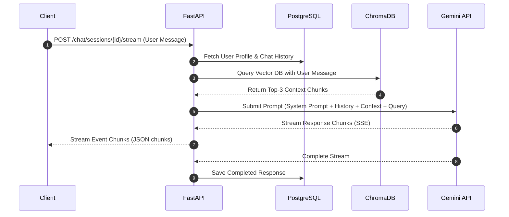
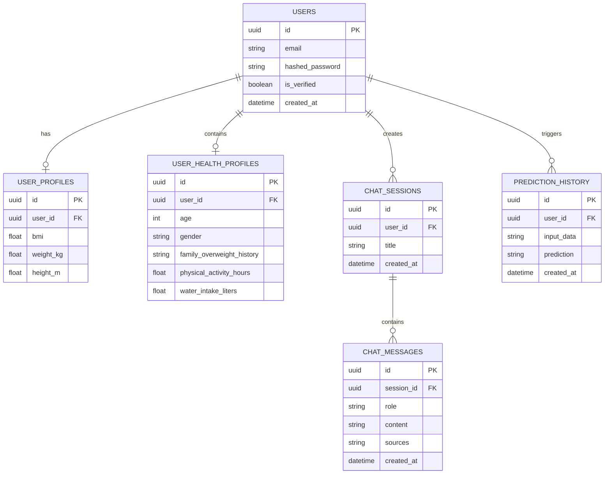

# System Logic & Workflow Documentation - HealthGPT

## 1. Introduction & Objectives

HealthGPT (Zentra) provides personalized clinical guidance, risk prediction, and health monitoring. It aims to deliver accurate, citation-backed medical information and automate obesity risk predictions using a clean, modern interface.

## 2. Core Functional Logic

### 2.1 Chat Processing & RAG Pipeline



### 2.2 Obesity Risk Prediction Pipeline

The obesity classification pipeline uses a Random Forest model with the following features:

#### Demographics & Measurements
- `Gender` (Categorical)
- `Age` (Numerical)
- `Height` (Numerical, meters)
- `Weight` (Numerical, kg)
- `BMI` (Derived: $\text{BMI} = \frac{\text{Weight}}{\text{Height}^2}$)

#### Family History & Diet
- `family_history_with_overweight` (Binary)
- `FAVC` (Frequent consumption of high-calorie food - Binary)
- `FCVC` (Frequency of consumption of vegetables - Numerical)
- `NCP` (Number of main meals - Numerical)
- `CAEC` (Consumption of food between meals - Categorical)

#### Lifestyle & Habits
- `SMOKE` (Binary)
- `CH2O` (Daily water intake - Numerical)
- `SCC` (Calories consumption monitoring - Binary)
- `FAF` (Physical activity frequency - Numerical)
- `TUE` (Time using technology devices - Numerical)
- `CALC` (Consumption of alcohol - Categorical)
- `MTRANS` (Transportation used - Categorical)

#### Preprocessing & Inference Flow
1. **Inputs**: Extracted from `UserHealthProfile` database tables.
2. **BMI Calculation**: Computed dynamically:
   $$\text{BMI} = \frac{\text{Weight}}{\text{Height}^2}$$
3. **Encoding**: Categorical columns are converted using saved label encoders:
   ```python
   for col, encoder in label_encoders.items():
       df[col] = encoder.transform(df[col])
   ```
4. **Encoding Multi-category features**: Snacking, Alcohol, and Transport modes are expanded using dummy variables and matched to `feature_columns.pkl`.
5. **Scaling**: Numerical features are scaled via `robust_scaler.pkl`:
   $$\hat{x} = \frac{x - Q_2(x)}{Q_3(x) - Q_1(x)}$$
6. **Inference**: The processed vector is classified by the Random Forest model.
7. **Mapping Output**: The predicted index is mapped to categories:
   - `Insufficient_Weight`
   - `Normal_Weight`
   - `Overweight_Level_I`
   - `Overweight_Level_II`
   - `Obesity_Type_I`
   - `Obesity_Type_II`
   - `Obesity_Type_III`

---

## 3. Database Schema Design


